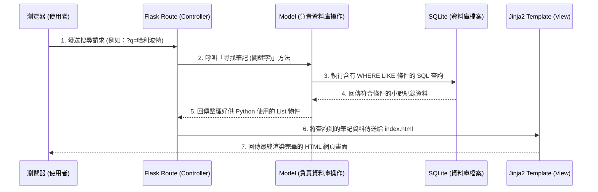

# 讀書筆記本（小說專用） 系統架構設計

## 1. 技術架構說明

本專案採用經典的 Web 後端渲染模式，並未刻意進行前後端分離。藉由此模式，我們可以快速從零打造出符合需求的 Web 應用。主要選用的技術與原因如下：

- **後端框架：Python + Flask**
  - **原因**：Flask 是輕量、靈活且學習曲線平緩的 PythonWeb 框架，非常適合初學者用來快速打造 MVP（最小可行性產品）。
- **前端模板引擎：Jinja2**
  - **原因**：Flask 內建支援 Jinja2 HTML 渲染引擎，可以非常方便地將後端撈取到的「小說紀錄」動態帶入 HTML 頁面中展示，大幅減少不必要的 API 串接工作。
- **資料庫：SQLite**
  - **原因**：作為輕量級的嵌入式關聯式資料庫，不需要額外架設與維護資料庫伺服器，資料會直接儲存為本地檔案（`database.db`），可以非常輕易地攜帶與分享。

**Flask 的 MVC 模式對應關係**：
- **Model（模型）**：我們將在 `models/` 目錄下定義資料庫邏輯。負責處理和 SQLite 資料庫之間的所有溝通（如：新增一筆紀錄，或查詢包含某關鍵字的小說清單）。
- **View（視圖）**：對應 `templates/` 目錄下的 Jinja2 HTML 檔案。負責決定最終使用者透過瀏覽器看到的介面長什麼樣子。
- **Controller（控制器）**：對應 `routes/` 目錄下的 Python 副程式。負責接收使用者的 HTTP 請求（例如：點擊了「刪除筆記」按鈕），並呼叫對應的 Model 修改資料，最後呼叫 View 返回更新後的畫面。

---

## 2. 專案資料夾結構

以下為本專案建議的資料夾結構，以模組化方式將不同職責的程式碼清楚分開：

```text
web_app_development/
├── app/
│   ├── models/           # 模型層 (Model)：管理資料結構與資料庫的操作
│   │   ├── __init__.py
│   │   └── note_model.py # 負責處理對「小說筆記」資料表的新增、修改、刪除與查詢邏輯
│   ├── routes/           # 路由層 (Controller)：定義 URL 與對應的處理邏輯
│   │   ├── __init__.py
│   │   └── note_routes.py# 處理與筆記相關的請求 (如：/, /add, /search)
│   ├── templates/        # 視圖層 (View)：存放所有的 Jinja2 HTML 模板
│   │   ├── base.html     # 共用模板 (包含網頁的標頭、導覽列、搜尋欄骨架)
│   │   ├── index.html    # 應用程式首頁 (用來顯示所有筆記清單內容)
│   │   └── form.html     # 用來新增或編輯筆記的填寫表單頁面
│   └── static/           # 靜態資源檔案目錄
│       ├── css/          # 用來美化版面的樣式表 (style.css)
│       └── js/           # 若有需要的前端互動輔助腳本
├── instance/
│   └── database.db       # SQLite 資料庫檔案 (系統運行時產生，請勿提交至 Git)
├── docs/                 # 存放專案的所有設計說明文件
│   ├── PRD.md            # 產品需求文件
│   └── ARCHITECTURE.md   # [本文件] 系統架構設計文件
├── app.py                # 應用程式的主要入口，負責啟動 Flask 伺服器並載入路由設定
└── requirements.txt      # 記錄專案運行必須安裝的 Python 套件清單
```

---

## 3. 元件關係圖

以下展示當使用者透過搜尋欄尋找某本小說時，系統內部的資料與邏輯是如何流動的：



---

## 4. 關鍵設計決策

1. **採用藍圖 (Blueprint) 或專責模組來管理路由**：
   我們不將所有路徑（路由）邏輯都寫進單一的 `app.py` 中，而是將對小說筆記的處理邏輯拆分至 `routes/note_routes.py`。這個設計能保證當未來功能擴充時（例如增加了「使用者管理」功能），專案依然能保持高度的清晰與可維護性。

2. **妥善利用 Jinja2 模板繼承 (Template Inheritance)**：
   透過設計一個基礎模板 `base.html` 來放所有頁面共用的 `<head>`、頂部導覽列以及全局樣式。其他頁面如 `index.html` 只要繼承它，就能確保所有網頁的外觀體驗具備高度一致性，同時減少重複性的 HTML 原始碼。

3. **統一收斂資料庫操作至 Model 層**：
    Controller 將不會直接操作 SQL 指令，而是全權委託給 `models/note_model.py` 提供的介面（函數）來處理。如此設計的彈性在於：現在即使我們用原生 Sqlite3 開發，以後想改成使用 SQLAlchemy 或移轉至 PostgreSQL 時，Controller 都不需要修改任何程式碼。

4. **單一欄位的智慧模糊搜尋**：
   根據 PRD，雖然希望同時透過「書名」與「作者」搜尋，但針對使用者體驗考量，前端將只保留一個統一搜尋欄。我們會由 Flask 的 Model 後端在執行資料庫指令時，合併搜查兩個不同的欄位 (`title LIKE '%keyword%' OR author LIKE '%keyword%'`)，以最小化用戶的操作門檻。
