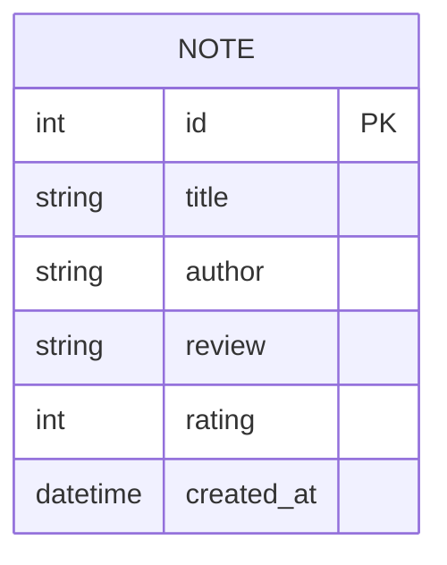

# 讀書筆記本（小說專用） 資料庫設計

本文件定義了應用程式的 SQLite 資料庫結構、實體關係圖（ER 圖）以及詳細的欄位規格。

## 1. ER 圖（實體關係圖）

## 2. 資料表詳細說明

### `notes` (小說筆記)

儲存使用者新增的每一筆小說閱讀紀錄。

| 欄位名稱 | 資料型別 | 屬性 | 說明 |
| :--- | :--- | :--- | :--- |
| `id` | INTEGER | PRIMARY KEY, AUTOINCREMENT | 唯一識別碼，系統自動產生 |
| `title` | TEXT | NOT NULL | 小說書名 |
| `author` | TEXT | NOT NULL | 小說作者 |
| `review` | TEXT | | 讀後心得 |
| `rating` | INTEGER | NOT NULL, CHECK(1-5) | 評分（1 到 5 星） |
| `created_at` | DATETIME | DEFAULT CURRENT_TIMESTAMP | 建立時間 |

## 3. SQL 建表語法

請參考 `database/schema.sql` 取得完整的建表語法。

## 4. Python Model

請參考 `app/models/note_model.py` 取得資料庫操作邏輯（包含 CRUD 方法及搜尋功能）。
