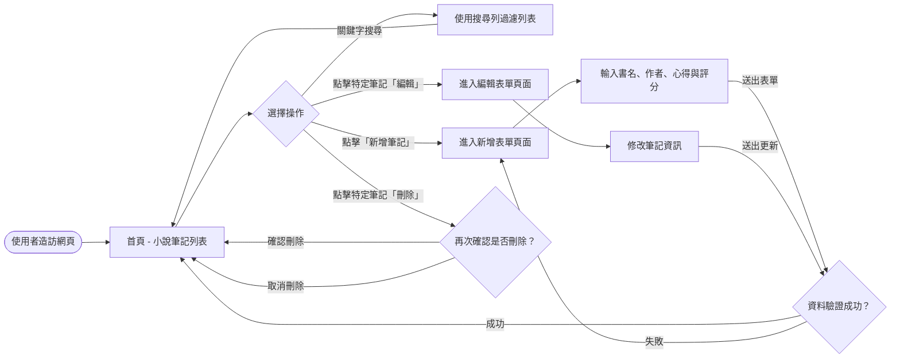
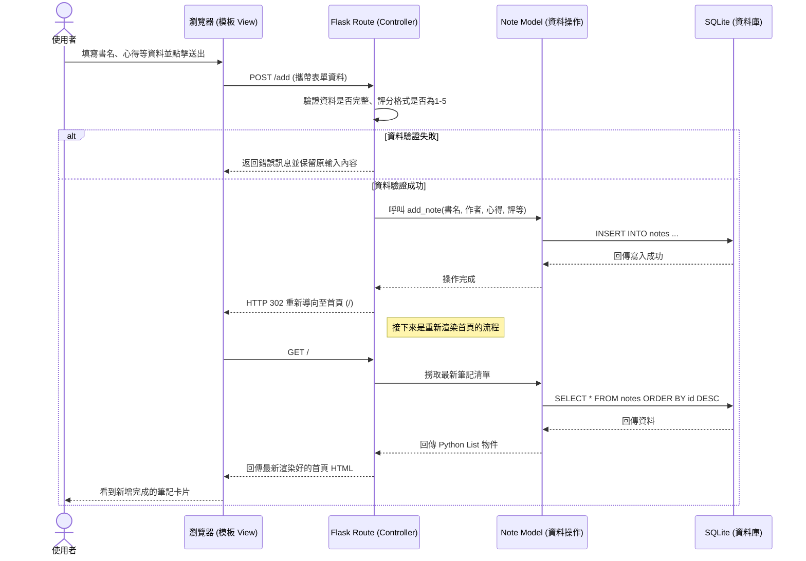

# 讀書筆記本（小說專用） 流程圖設計

本文件透過視覺化的方式，說明使用者如何操作本應用程式，以及系統內部資料如何互動。

## 1. 使用者流程圖（User Flow）

此流程圖描述使用者從進入應用程式首頁開始，能夠執行哪些操作、以及頁面之間的跳轉邏輯。

## 2. 系統序列圖（Sequence Diagram）

此序列圖以「**使用者新增一筆小說紀錄**」為例，說明從前端瀏覽器傳送資料，一路經過後端 Flask 到儲存進 SQLite 資料庫的完整過程。

## 3. 功能清單與路由對照表

此表列出每項系統功能的對應 URL 設計與使用的 HTTP 方法，為接下來的 API 設計及實作打好基礎：

| 功能名稱 | URL 路徑 | HTTP 方法 | 說明 |
| :--- | :--- | :--- | :--- |
| **首頁與清單展示** | `/` | `GET` | 撈取並渲染全數的小說筆記清單。 |
| **搜尋筆記** | `/?search=關鍵字` | `GET` | 透過參數進行「書名」或「作者」的模糊搜尋，並返回過濾清單。 |
| **新增筆記（進入頁面）** | `/add` | `GET` | 顯示新增用的空白表單頁面。 |
| **新增筆記（送出表單）** | `/add` | `POST` | 接收表單送出的資料寫入資料庫，成功後導向 `/`。 |
| **編輯筆記（進入頁面）** | `/edit/<id>` | `GET` | 取得指定 `<id>` 的筆記資料並顯示在表單中。 |
| **編輯筆記（送出表單）** | `/edit/<id>` | `POST` | 接收修改後的表單資料並更新回資料庫，成功後導向 `/`。 |
| **刪除筆記** | `/delete/<id>` | `POST` | 根據指定的 `<id>` 將筆記進行刪除，成功後導向 `/`。（註：避免使用 GET 來設計刪除路由，以防安全問題） |
